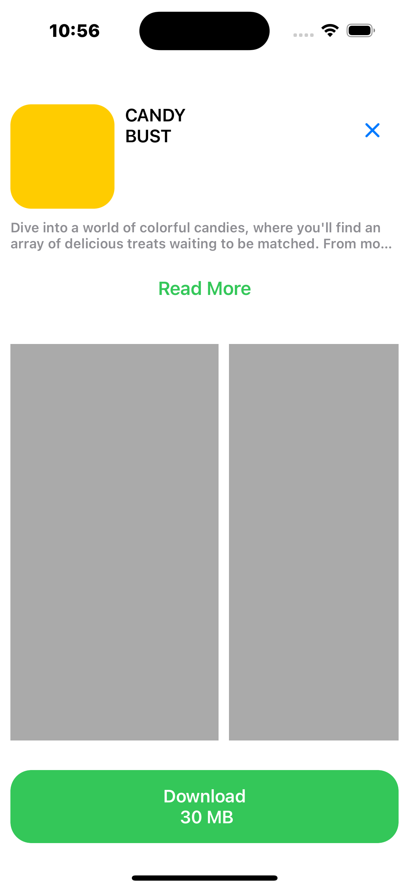

# Game Store

Welcome to the Game Store project! This is a Swift-based iOS app that allows you to browse and purchase games. In this README, you will find information about the project, its features, how to run it, and a link to a video demo.

## Table of Contents
- [Features](#features)
- [Screenshots](#screenshots)
- [Video Link](#VideoLink)

## Features

- Browse a wide selection of games.
- View detailed information about each game, including descriptions, prices, and reviews.
- Secure payment processing for game purchases.
- User accounts with profile management.
- User-friendly and intuitive interface.

## Screenshots

## VideoLink
[https://drive.google.com/file/d/1OIzb7dkQB_B37-So5_I6WUFW4yaP-O7a/view?usp=drive_link](https://drive.google.com/file/d/1OIzb7dkQB_B37-So5_I6WUFW4yaP-O7a/view?usp=drive_link)